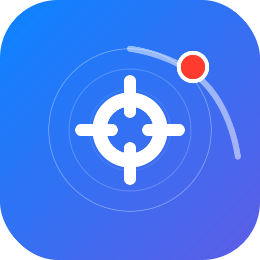

<div align="center">
  
  <h1>PortWatcher</h1>
</div>
**PortWatcher** is a lightweight, minimal macOS menubar utility designed for developers. It helps you quickly identify and terminate processes listening on `localhost` ports—perfect for those times you forget to close an `npm` server or a background Python script.

## ✨ Features

-   **Snappy Interface**: No animations, just instant access to your active ports.
-   **Intelligent App Resolution**: Automatically identifies the parent application (e.g., "Visual Studio Code" instead of just "electron" or "Code Helper").
-   **Graceful & Forceful Termination**:
    -   **Quit**: Sends a graceful `SIGTERM` to the process.
    -   **Force**: Sends a `SIGKILL` for stubborn background processes.
-   **Smart Filtering**: Automatically hides common macOS system services (like AirPlay or Control Center) to focus on your dev environment.
-   **Customizable Settings**: Toggle auto-refresh or system process filtering via the Preferences panel.
-   **Left/Right Click Mastery**:
    -   **Left-Click**: View and manage active ports.
    -   **Right-Click**: Access Settings or Quit PortWatcher.

## 🚀 Installation

You can install PortWatcher directly from the source. Make sure you have Xcode or the Swift toolchain installed.

1.  **Clone the repository**:
    ```bash
    git clone https://github.com/umutybaki/PortWatcher.git
    cd PortWatcher
    ```

2.  **Run the Installer**:
    ```bash
    chmod +x install.sh
    ./install.sh
    ```

The installer will build the app, move it to your `/Applications` folder, and launch it automatically.

## 🛠️ Usage

-   **Check Ports**: Click the Globe icon in your menubar to see what's running.
-   **Kill a Process**: Use the **Quit** or **Force** buttons next to any port.
-   **Configure**: Right-click the menubar icon and select **Settings...** to toggle auto-refresh or filtering.
-   **Manual Refresh**: Click the circular arrow icon in the top right of the popover.

## 🏗️ Requirements

-   macOS 13.0 (Ventura) or later.
-   Swift 5.7+ (for building from source).

## 📄 License

This project is licensed under the [MIT License](LICENSE).
